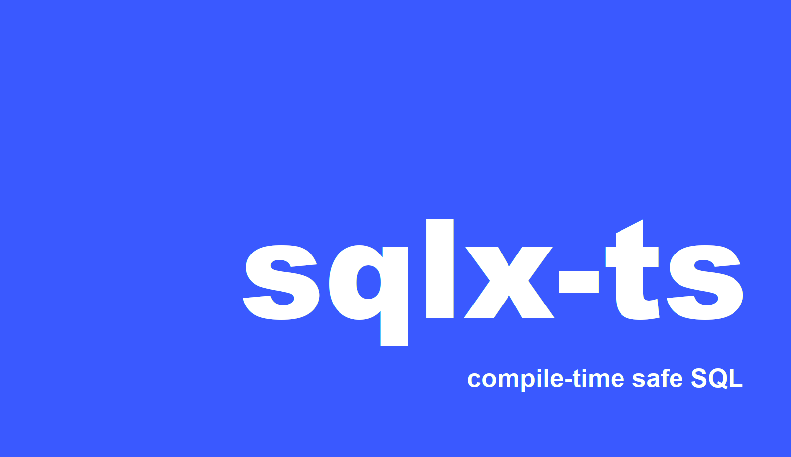

 <strong>
   🧰 The Typescript/Javascript SQL Toolkit
 </strong>

 

SQLx-ts is a CLI application featuring compile-time checked queries without a DSL and generates types against SQLs to keep your code type-safe

- **Compile time checked queries** - never ship a broken SQL query to production (and [sqlx-ts is not an ORM](https://github.com/JasonShin/sqlx-ts#sqlx-ts-is-not-an-orm))
- **TypeScript type generations** - generates type definitions based on the raw SQLs and you can use them with any MySQL or PostgreSQL driver
- **Database Agnostic** - support for [PostgreSQL](http://postgresql.org/) and [MySQL](https://www.mysql.com/) (and more DB supports to come)
- **TypeScript and JavaScript** - supports for both [TypeScript](https://jasonshin.github.io/sqlx-ts/reference-guide/4.typescript-types-generation.html) and [JavaScript](https://github.com/JasonShin/sqlx-ts#using-sqlx-ts-in-vanilla-javascript)

### sqlx-ts is not an ORM!

sqlx-ts supports **compile-time checked queries** and **generated types against SQLs**. It does not, however, do this by providing DSL (domain-specific language) for building queries. Instead, it provides macros that take regular SQL as input and ensure that it is valid against the target database. The way it works is that sqlx-ts connects to your local or development database at compile-time and have database itself to verify the queries, also generate types based on information_schema. This can have many benefits that typical ORMs cannot provide
- Since sqlx-ts simply sends the queries back to the DB, almost any SQL syntax can be used in sqlx-ts (including things added by database extensions)
- You can easily optimize the queries as the SQLs are not built using a query-builder or an ORM interface
- The generated types work well with almost any database driver or even ORMs if they have good typescript support (that allows you to override input and output types)

but it comes with some implications
- The amount of information that sqlx-ts retrieves depend on the type of the database (e.g. MySQL vs PostgreSQL)

If you are looking for an ORM, you can checkout [Sequelize](https://sequelize.org/) or [Prisma](https://www.prisma.io/).

### Using sqlx-ts in vanilla JavaScript

If you are trying to use sqlx-ts against vanilla JS, the [TypeScript type-generation](https://jasonshin.github.io/sqlx-ts/reference-guide/4.typescript-types-generation.html) feature wouldn't be helpful. You can simply use [SQL Check](https://jasonshin.github.io/sqlx-ts/reference-guide/1.sql-check.html) feature to keep your SQLs in JS code safe and compile-time checked.

### Motivation

I would like to bring the powerful compile-time safety ideas to Node.js. [sqlx](https://github.com/launchbadge/sqlx) is a great example of this, as it provides compile-time check of SQLs within your Rust code and Rust itself provides a great environment for tools like sqlx. sqlx-ts is greatly inspired by [sqlx](https://github.com/launchbadge/sqlx), but solves additional problems of generating TypeScript interfaces based on the SQL queries that are present in your code.

Introduction

