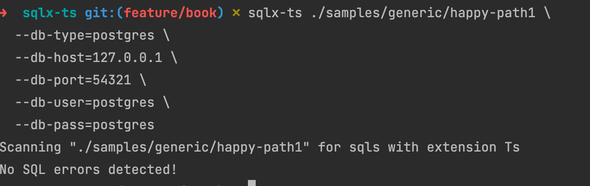

# SQL Check

Checking SQL is the core functionality of sqlx-ts. It is the default command when you run 
`sqlx-ts` binary as well.

By default, you pass in connection options to connect to the primary database. You can configure how 
sqlx-ts figures out database connection configurations by checking out the [configuration page](../guides/2.configuration.md)

## Running sqlx-ts to check SQLs

```bash
sqlx-ts <path-to-node-project> \
  --config .sqlxrc.json \
  -g
```

As a result, you'd get, for example:



