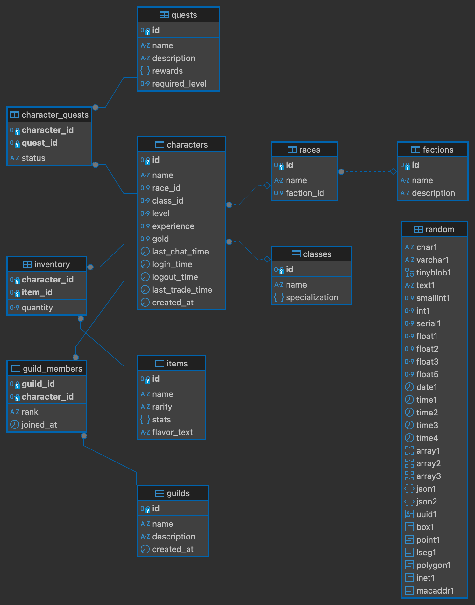

# World of Warcraft Inspired SQL Schema

This repository contains a comprehensive World of Warcraft-themed SQL schema designed to demonstrate the capabilities of [sqlx-ts](https://github.com/JasonShin/sqlx-ts). The schema models core game mechanics such as characters, races, classes, guilds, items, and quests, while incorporating MySQL and PostgreSQL's advanced features like JSONB, ENUM types, and relationships.

## Overview
The schema covers:
- **Factions**: Represents the two primary factions - Alliance and Horde.
- **Races**: Lists all playable races, associated with their faction.
- **Classes**: Defines class specializations, including roles, weapons, and abilities stored as JSONB.
- **Characters**: Central entity representing player characters, linked to races and classes.
- **Guilds**: Guilds that characters can join, supporting a many-to-many relationship.
- **Items**: Collectible items with dynamic stats stored as JSONB.
- **Inventory**: Tracks character inventory, supporting multiple item quantities.
- **Quests**: Represents character progression, including quest rewards and status.
- **Random Data**: Demonstrates MySQL/PostgreSQL's wide range of data types for testing and exploration.

## ERD Diagram



## Installation and Setup

1. Clone this repository:
   ```bash
   git clone https://github.com/jasonshin/sqlx-ts
   ```
   
2. Ensure that you have [docker](https://www.docker.com/) and [docker-compose](https://docs.docker.com/compose/) installed

3. Navigate to root directory of the project:
   ```bash
   docker compose up -d
   ```

4. Run the SQL schema on your MySQL/PostgreSQL instance:
   ```bash
   mysql -h 127.0.0.1 -P 33306 -u root sqlx-ts
   psql -h 127.0.0.1 -p 54321 -U postgres # and then enter `postgres` as password
   ```

## Key Features
- **Enum Types**: Faction, Race, and Class columns leverage MySQL/PostgreSQL ENUMs for better data consistency.
- **JSONB Fields**: Flexible and scalable fields for class specializations, item stats, and quest rewards.
- **Referential Integrity**: Foreign key relationships ensure data consistency across races, classes, and factions.
- **Various types**: The schema utilises a wide range of string/numeric/date types to ensure every types are supported by sqlx-ts
- **Complex Constraints**: Advanced CHECK constraints validate JSONB fields to ensure proper specialization structures.

## Example Queries
Fetch all characters with their race and class:
```sql
SELECT c.name AS character_name, r.name AS race, cl.name AS class
FROM characters c
JOIN races r ON c.race_id = r.id
JOIN classes cl ON c.class_id = cl.id;
```

Retrieve all items in a character's inventory:
```sql
SELECT ch.name AS character_name, i.name AS item, inv.quantity
FROM inventory inv
JOIN characters ch ON inv.character_id = ch.id
JOIN items i ON inv.item_id = i.id;
```

List all active quests for a character:
```sql
SELECT q.name AS quest_name, cq.status
FROM character_quests cq
JOIN quests q ON cq.quest_id = q.id
WHERE cq.character_id = 1;
```

## License
Please refer to [LICENSE](../LICENSE)


